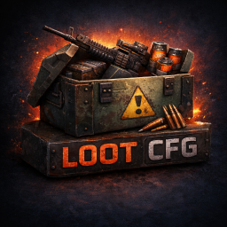

  

<h1 align="center">RustCentral Editor</h1>

  <strong>Desktop control center for Rust plugin configs.</strong>
   
  Edit BetterLoot, BetterTC, Kits, HUD and other supported setups visually, stay connected to your RustCenter account, work across repeat server workflows, and keep your desktop app aligned with the RustCenter release channel.

  <a href="https://github.com/DeltaDinizzz/RustCenterApp/releases/latest"><strong>Download</strong></a>
  &middot;
  <a href="#downloads"><strong>Install Guide</strong></a>
  &middot;
  <a href="https://rustcenter.org"><strong>Website</strong></a>
  &middot;
  <a href="https://rustcenter.org/dashboard"><strong>Dashboard</strong></a>
  &middot;
  <a href="https://discord.gg/nDPnCUXJqQ"><strong>Discord</strong></a>
  &middot;
  <a href="https://github.com/sponsors/DeltaDinizzz"><strong>Sponsor</strong></a>

  
  
  
  
  
  
  
  
  

 

> **Server telemetry inside RustCentral Editor (Near Future).**
> RustCentral Editor brings RustCenter-linked server visibility into the same desktop workflow, including monitoring flows powered by `ServerMonitor.cs`, so plugin configuration and live server awareness sit together in one place.

 

<table>
  <tr>
    <td align="center"><strong>Works with</strong></td>
    <td align="center">🎯 BetterLoot</td>
    <td align="center">🏠 BetterTC</td>
    <td align="center">🎒 Kits</td>
    <td align="center">🖥️ HUD</td>
    <td align="center">🔐 RustCenter Auth</td>
    <td align="center">⚡ Auto Update</td>
    <td align="center">🌐 Release Channel</td>
    <td align="center">🧭 Multi Server (Near Future)</td>
    <td align="center">📡 Server Monitor (Near Future)</td>
  </tr>
</table>

 

<table>
  <tr>
    <td align="center"><strong>Runs on</strong></td>
    <td align="center"><a href="#downloads">🪟 Windows x64 setup.exe / .msi</a></td>
    <td align="center"><a href="#downloads">🐧 Linux x86_64 AppImage / .deb</a></td>
    <td align="center"><a href="#downloads">🦾 Linux ARM64 AppImage / .deb</a></td>
    <td align="center"><a href="#downloads">🍎 macOS Apple Silicon .dmg</a></td>
    <td align="center"><a href="#downloads">💻 macOS Intel .dmg</a></td>
  </tr>
</table>

  
  
  
  
  

 

## ✨ Features

<table>
<tr>
<td align="center" width="33%">
<h3>🧩 Visual plugin editing</h3>
Open supported configs and work through a desktop UI instead of hand-editing raw JSON files.
</td>
<td align="center" width="33%">
<h3>🔐 RustCenter sign-in</h3>
Use your RustCenter account for desktop access, plan checks, and entitlement-aware app behavior.
</td>
<td align="center" width="33%">
<h3>⚡ Built-in updater</h3>
The app can detect new signed releases through the RustCenter update channel and GitHub Releases.
</td>
</tr>
<tr>
<td align="center">
<h3>💾 Safer config workflow</h3>
Make changes visually and reduce the risk of breaking files with manual syntax mistakes.
</td>
<td align="center">
<h3>🛠️ Expansion-ready</h3>
The app is built around expandable editors, so new Rust config workflows can be added over time.
</td>
<td align="center">
<h3>🌍 Account links</h3>
Open dashboard and subscription pages directly on RustCenter when you need to manage access.
</td>
</tr>
<tr>
<td align="center">
<h3>📦 Release-first distribution</h3>
Stable desktop downloads are delivered through GitHub Releases instead of ad-hoc file drops.
</td>
<td align="center">
<h3>🧭 Multi-server control (Near Future)</h3>
Manage repeated config work across several Rust servers from one desktop flow instead of treating every server as an isolated manual pass.
</td>
<td align="center">
<h3>📈 Server monitoring panels (Near Future)</h3>
View RustCenter-linked server status, telemetry, and `ServerMonitor.cs` feeds beside the same config workflows you already use in the editor.
</td>
</tr>
</table>

 

## 🧠 Why this app exists

<table>
<tr>
<td width="50%">
<h3>Without RustCentral Editor</h3>

- ❌ Manual JSON editing everywhere
- ❌ Higher chance of syntax mistakes
- ❌ Harder to maintain multiple plugin configs across servers
- ❌ Desktop workflow disconnected from your RustCenter account and release channel
</td>
<td width="50%">
<h3>With RustCentral Editor</h3>

- ✅ Visual editing for supported Rust plugin setups
- ✅ Cleaner desktop workflow for repeated config changes
- ✅ Centralized account-aware access through RustCenter
- ✅ Direct path to new releases, multi-server control, and server-aware desktop workflows (Near Future)
</td>
</tr>
</table>

 

## 🌐 RustCenter ecosystem

RustCentral Editor is not just a standalone installer. It sits inside a larger RustCenter flow.

| Part | What it does |
|------|--------------|
| **RustCentral Editor** | Desktop app for editing supported plugin configs visually. |
| **RustCenter Website** | Account, dashboard, subscription, downloads, and broader platform features. |
| **RustCenter Auth** | Sign-in flow and plan-aware desktop access. |
| **GitHub Releases** | Hosts signed release assets used for manual download and updater delivery. |
| **ServerMonitor.cs** | Feeds the RustCenter monitoring pipeline that surfaces inside RustCentral Editor for server-aware desktop workflows (Near Future). |
| **CodeFling / linked services** | Part of the broader RustCenter direction for account-linked plugin and server tooling. |

## 🚀 Getting started

1. Open the latest release: [`Download RustCentral Editor`](https://github.com/DeltaDinizzz/RustCenterApp/releases/latest)
2. Pick the installer that fits your setup.
3. Install the app.
4. Sign in with your RustCenter account.
5. Open a supported config and start editing.
6. Connect your config workflow with RustCenter-linked monitoring and server visibility in the same desktop flow (Near Future).

## 📦 Which file should I download?

  
  
  
  
  
  

### 🪟 Windows x64

- `RustCentralEditor_<version>_windows_x64_setup.exe`: best choice for most Windows users who just want to install and launch the app.
- `RustCentralEditor_<version>_windows_x64.msi`: better fit for manual deployment, managed installs, or environments that prefer standard MSI packaging.
- `RustCentralEditor_<version>_windows_x64_setup.nsis.zip` and `RustCentralEditor_<version>_windows_x64.msi.zip`: updater packages used by the in-app update channel.
- `*.sig`: signature files that validate updater and release-channel assets.

**Normal user choice:** `setup.exe`

### 🐧 Linux x86_64

- `RustCentralEditor_<version>_linux_amd64.AppImage`: the easiest portable Linux option for most users.
- `RustCentralEditor_<version>_linux_amd64.deb`: best for Debian, Ubuntu, Mint, Pop!_OS, and similar Debian-based systems.
- `RustCentralEditor_<version>_linux_amd64.AppImage.tar.gz`: updater payload used by the in-app release channel.
- `*.sig`: signature files for updater and verification flows.

**Normal user choice:** `AppImage` for portability, `.deb` for Debian/Ubuntu-style installs

### 🦾 Linux ARM64

- `RustCentralEditor_<version>_linux_aarch64.AppImage`: portable ARM64 Linux build.
- `RustCentralEditor_<version>_linux_arm64.deb`: ARM64 `.deb` package for Debian/Ubuntu-based ARM systems.
- `RustCentralEditor_<version>_linux_aarch64.AppImage.tar.gz`: updater payload for the ARM64 release channel.
- `*.sig`: signature files for updater and verification flows.

**Normal user choice:** `AppImage` for portability, `.deb` for Debian/Ubuntu-style ARM installs

### 🍎 macOS Apple Silicon

- `RustCentralEditor_<version>_darwin_aarch64.dmg`: installer image for Apple Silicon Macs.
- `RustCentralEditor_<version>_darwin_aarch64.app.tar.gz`: updater payload used by the release channel.
- `*.sig`: signature files for updater and verification flows.

**Normal user choice:** `darwin_aarch64.dmg`

### 💻 macOS Intel

- `RustCentralEditor_<version>_darwin_x64.dmg`: installer image for Intel Macs.
- `RustCentralEditor_<version>_darwin_x64.app.tar.gz`: updater payload used by the release channel.
- `*.sig`: signature files for updater and verification flows.

**Normal user choice:** `darwin_x64.dmg`

### 🧾 What most users should ignore

- `latest.json`: used by the updater, not by manual installers.
- `.sig`: verification assets, not something most users open directly.
- `.zip` and `.tar.gz`: usually updater and release-channel files rather than the normal installer a person clicks first.

If you only want to install the app yourself, start with the platform installer/package, not the updater artifacts.

## 🔄 How updates work

- The app checks RustCenter's update endpoint.
- RustCenter points the app to the correct release assets on GitHub Releases.
- Signed updater packages and `.sig` files are used to verify authenticity.
- Manual users can always download directly from the latest release page.

## 🖥️ Best fit for

- Rust server admins maintaining BetterLoot, BetterTC, Kits, HUD and similar setups.
- Server owners who want a visual desktop workflow instead of raw config editing.
- People managing several server configs and wanting a cleaner repeatable process.
- Users already working inside the RustCenter ecosystem.

## 🧪 Current focus vs roadmap

| Today | Next |
|------|------|
| Visual editing for supported plugin config workflows | Richer server-aware workflows inside the desktop experience |
| RustCenter sign-in and entitlement-aware access | Desktop visibility for server telemetry and monitoring data (Near Future) |
| GitHub Releases + signed updater pipeline | Deeper integration with the wider RustCenter platform |
| Desktop-first config workflow | Broader ecosystem features around monitoring and multi-server control (Near Future) |

## 🆘 Community and support

- 🌐 Website: [rustcenter.org](https://rustcenter.org)
- 🧭 Dashboard: [RustCenter Dashboard](https://rustcenter.org/dashboard)
- 💳 Subscription: [Manage Subscription](https://rustcenter.org/dashboard/subscription)
- 💬 Discord: [Join the community](https://discord.gg/nDPnCUXJqQ)
- 📦 Releases: [GitHub Releases](https://github.com/DeltaDinizzz/RustCenterApp/releases)
- 🐞 Issues: [Report a problem](https://github.com/DeltaDinizzz/RustCenterApp/issues)
- 💖 Sponsor: [GitHub Sponsors](https://github.com/sponsors/DeltaDinizzz)

## 📜 License

RustCentral Editor is proprietary software.

See [`COPYRIGHT`](./COPYRIGHT) for the current terms.
